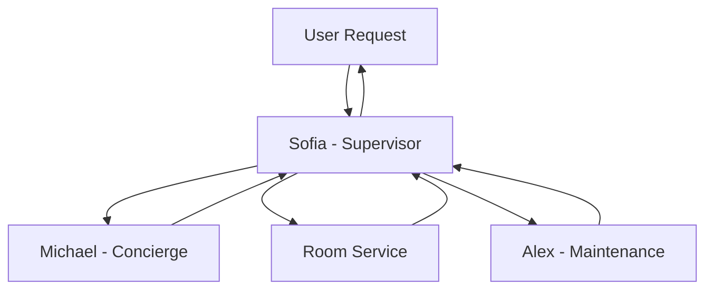

# 🏨 Hotel Service Coordinator

<div align="center">


A modern multi-agent AI concierge system that provides seamless hotel services through natural conversation.

[](https://www.python.org/downloads/)
[](https://docs.chainlit.io)
[](https://opensource.org/licenses/MIT)

[Demo](https://demo-link) · [Documentation](docs/) · [Report Bug](issues/new) · [Request Feature](issues/new)

</div>

## ✨ Features

- 🤖 **Multi-Agent System** - Specialized agents for concierge, room service, and maintenance
- 💬 **Natural Conversation** - Human-like interactions powered by GPT-4
- 🔍 **Smart Web Search** - Integrated SerpAPI for real-time information
- 🌐 **Website Content Access** - Crawl4AI integration for rich web content
- 📝 **Context Awareness** - Maintains conversation history for better assistance
- 📊 **Usage Monitoring** - Built-in tracking and limits

## 🤖 Agent System

Our multi-agent system consists of specialized AI agents, each with unique capabilities:



The system operates through a coordinated hierarchy:
- **Supervisor Agent (Sofia)** analyzes requests and delegates to specialists
- **Concierge Agent (Michael)** handles local information and arrangements
- **Room Service Agent** manages all food and beverage requests
- **Maintenance Agent (Alex)** coordinates room-related services

Each agent is powered by GPT-4 and equipped with specialized tools for their domain. The supervisor ensures seamless coordination and maintains conversation context across all interactions.

### 🎭 Supervisor Agent (Sofia)

- **Role**: Hotel Concierge Manager with 15 years of luxury hospitality experience
- **Responsibilities**:
    - Analyzes and routes guest requests to specialized agents
    - Coordinates responses from multiple agents
    - Maintains conversation context and history
    - Ensures consistent service quality

### 🛎️ Concierge Agent (Michael)

- **Role**: Knowledgeable local expert and guest experience specialist
- **Capabilities**:
    - Local recommendations and information
    - Real-time web searches via SerpAPI
    - Website content retrieval with Crawl4AI
    - Transportation and activity arrangements
    - Event bookings and reservations

### 🍽️ Room Service Agent

- **Role**: Food and beverage specialist
- **Features**:
    - Full menu access and availability checking
    - Special dietary requirements handling
    - Meal customization and modifications
    - Service timing coordination
- **Hours**: 24/7 with specialized menus for:
    - Breakfast (6:00 AM - 11:00 AM)
    - All-day dining (11:00 AM - 10:00 PM)
    - Late night (10:00 PM - 6:00 AM)

### 🔧 Maintenance Agent (Alex)

- **Role**: Maintenance and Housekeeping Specialist
- **Services**:
    - Room supplies and amenities
    - Climate control management
    - Housekeeping requests
    - Basic repairs and maintenance
- **Response Times**:
    - Room Supplies: 5-10 minutes
    - Climate Control: 10-15 minutes
    - Housekeeping: 20-30 minutes
    - Basic Repairs: 30-45 minutes

## 🚀 Quick Start

### Using Docker (Recommended)

1. Clone and set up:

```bash
git clone <repository-url>
cd hotel-service-coordinator
cp .env.example .env
```

2. Add your API keys to `.env`:

```env
OPENAI_API_KEY=your-key-here
SERPAPI_API_KEY=your-key-here
```

3. Run with Docker:

```bash
docker compose up --build
```

Visit `http://localhost:8000` to start using your AI concierge!

### Local Development

1. Set up environment:

```bash
# Create conda environment
conda create -n hotel-coordinator python=3.11 -y
conda activate hotel-coordinator

# Install dependencies
pip install poetry
poetry install
```

2. Run the application:

```bash
poetry run chainlit run src/app.py
```

## 🏗️ Architecture

```
src/
├── agents/                      # Specialized AI agents
│   ├── concierge_agent.py      # Local recommendations & info
│   ├── room_service_agent.py   # Food & beverage orders
│   ├── maintenance_agent.py    # Room services & maintenance
│   ├── supervisor_agent.py     # Request coordination
│   └── tools/                  # Shared agent tools
├── models/                     # Data models & types
└── app.py                      # Main Chainlit application
```

## 🛠️ Development

The project uses modern Python tools:
- **Poetry** - Dependency management
- **Black** - Code formatting
- **Ruff** - Fast linting
- **MyPy** - Static type checking

Run development tools:

```bash
poetry run black .
poetry run ruff check .
poetry run mypy .
```

## 🔑 Environment Variables

Required API keys (add to `.env`):
- `OPENAI_API_KEY` - OpenAI API key for GPT-4
- `SERPAPI_API_KEY` - SerpAPI key for web searches

## 📚 Documentation

- [Agent System](docs/agents.md) - Details on the multi-agent architecture
- [API Integration](docs/apis.md) - Guide to the external API integrations
- [Development Guide](docs/development.md) - Setting up for development

## 🤝 Contributing

Contributions are welcome! Please check our [Contributing Guidelines](CONTRIBUTING.md).

## 📝 License

This project is [MIT](LICENSE) licensed.

---

<div align="center">
Made with ❤️ by [Your Name/Organization]
</div>
